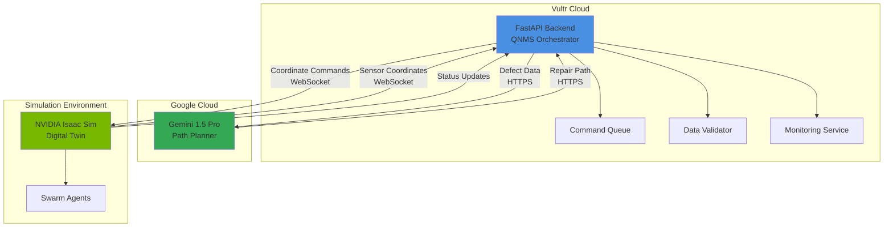

# Design Document: Quantum-Nano Maintenance Swarm (QNMS)

## Overview

The Quantum-Nano Maintenance Swarm (QNMS) is a cloud-robotics system that orchestrates nano-scale semiconductor repair operations through AI-powered path planning and digital twin simulation. The system consists of three primary components:

1. **FastAPI Backend** - Hosted on Vultr, serves as the central orchestration hub
2. **Gemini 1.5 Pro Agent** - Provides intelligent repair path planning and optimization
3. **NVIDIA Isaac Sim Digital Twin** - Simulates and executes swarm agent operations

The architecture follows a hub-and-spoke pattern where the FastAPI backend mediates all communication between the AI planning layer (Gemini) and the simulation/execution layer (Isaac Sim). This design ensures separation of concerns, enables independent scaling of components, and provides a single point of control for monitoring and error handling.

## Architecture

### System Architecture Diagram



### Communication Flow

1. **Sensor Data Ingestion**: Isaac Sim detects defects and sends sensor coordinates via WebSocket to the FastAPI backend
2. **AI Planning**: Backend forwards defect data to Gemini 1.5 Pro via HTTPS REST API
3. **Path Generation**: Gemini analyzes defects and generates optimized repair paths
4. **Command Distribution**: Backend converts repair paths into coordinate commands and sends them to Isaac Sim
5. **Execution**: Isaac Sim distributes commands to individual swarm agents for execution
6. **Status Reporting**: Agents report completion status back through Isaac Sim to the backend

### Technology Stack

- **Backend Framework**: FastAPI (Python 3.11+)
- **Web Server**: Uvicorn with WebSocket support
- **AI Integration**: Google Gemini 1.5 Pro API
- **Communication**: WebSocket (Isaac Sim), HTTPS REST (Gemini)
- **Data Validation**: Pydantic v2
- **Monitoring**: Prometheus metrics + structured logging
- **Hosting**: Vultr cloud compute instance

## Components and Interfaces

### 1. FastAPI Backend (QNMS Orchestrator)

The central orchestration service that manages all system interactions.

#### Core Modules

**API Router** (`api/routes.py`)
- Exposes REST endpoints for health checks and manual operations
- Handles WebSocket connections from Isaac Sim
- Implements request/response validation using Pydantic models

**Connection Manager** (`core/connections.py`)
- Maintains persistent WebSocket connection to Isaac Sim
- Manages HTTP client for Gemini API calls
- Implements reconnection logic with exponential backoff
- Tracks connection health and status

**Data Validator** (`core/validator.py`)
- Validates sensor coordinates (type, range, precision)
- Validates coordinate commands (safety bounds, thermal limits)
- Enforces 0.1nm grid alignment for atomic precision
- Checks no-go zones and collision constraints

**Command Queue** (`core/queue.py`)
- Thread-safe queue for pending coordinate commands
- Prioritizes commands based on defect severity
- Tracks command status (pending, in-progress, completed, failed)
- Implements command deduplication

**Gemini Client** (`integrations/gemini_client.py`)
- Wraps Gemini 1.5 Pro API calls
- Formats defect data for AI consumption
- Parses repair path responses
- Handles API errors and retries

**Isaac Sim Client** (`integrations/isaac_client.py`)
- Manages WebSocket communication with Isaac Sim
- Serializes/deserializes messages
- Implements message acknowledgment protocol
- Buffers commands during connection interruptions

**Monitoring Service** (`core/monitoring.py`)
- Exposes Prometheus metrics endpoint
- Tracks latency, throughput, error rates
- Maintains counters for repairs (successful, failed, pending)
- Logs all operations with correlation IDs

#### Data Models

**SensorCoordinate** (Pydantic Model)
```python
class SensorCoordinate:
    x: float  # nanometers, 0.1nm precision
    y: float  # nanometers, 0.1nm precision
    z: float  # nanometers, 0.1nm precision
    defect_type: str
    severity: int  # 1-10 scale
    timestamp: datetime
    correlation_id: str
```

**CoordinateCommand** (Pydantic Model)
```python
class CoordinateCommand:
    agent_id: str
    target_x: float  # nanometers, 0.1nm grid-aligned
    target_y: float  # nanometers, 0.1nm grid-aligned
    target_z: float  # nanometers, 0.1nm grid-aligned
    action_type: str  # "move", "repair", "scan"
    thermal_budget: float  # degrees Celsius
    estimated_duration: float  # milliseconds
    correlation_id: str
```

**RepairPath** (Pydantic Model)
```python
class RepairPath:
    defect_id: str
    commands: list[CoordinateCommand]
    total_distance: float  # nanometers
    estimated_time: float  # milliseconds
    priority: int  # 1-10 scale
    safety_validated: bool
    correlation_id: str
```

### 2. Gemini Integration Layer

Interfaces with Gemini 1.5 Pro for intelligent repair path planning.

#### Prompt Engineering Strategy

The system uses structured prompts that include:
- Defect coordinates and severity levels
- Current swarm agent positions
- Physical constraints (thermal budget, no-go zones, collision radius)
- Optimization objectives (minimize distance, prioritize critical defects)

**Example Prompt Structure**:
```
You are a nano-scale repair path planner for semiconductor manufacturing.

DEFECTS:
- Defect 1: (x=5.2nm, y=3.1nm, z=0.8nm), severity=8, type=gate_oxide_breach
- Defect 2: (x=7.5nm, y=4.3nm, z=1.2nm), severity=5, type=metal_void

CONSTRAINTS:
- Grid alignment: 0.1nm
- Thermal limit: 120°C per operation
- Collision radius: 0.5nm minimum separation
- No-go zones: [(x=6.0-6.5nm, y=3.0-4.0nm, z=0.0-2.0nm)]

SWARM AGENTS:
- Agent A: current position (2.0nm, 2.0nm, 1.0nm)
- Agent B: current position (8.0nm, 5.0nm, 1.5nm)

Generate an optimized repair path that minimizes total travel distance while respecting all constraints.
Output format: JSON array of coordinate commands.
```

#### Response Parsing

Gemini responses are parsed as JSON and validated against the RepairPath schema. The system handles:
- Malformed JSON responses
- Missing required fields
- Invalid coordinate values
- Constraint violations

### 3. Isaac Sim Integration Layer

Manages bidirectional communication with NVIDIA Isaac Sim digital twin.

#### WebSocket Protocol

**Message Format** (JSON over WebSocket)
```json
{
  "type": "sensor_data" | "command" | "status" | "ack",
  "payload": { ... },
  "timestamp": "ISO-8601",
  "correlation_id": "uuid"
}
```

**Sensor Data Message** (Isaac Sim → Backend)
```json
{
  "type": "sensor_data",
  "payload": {
    "coordinates": [
      {"x": 5.2, "y": 3.1, "z": 0.8, "defect_type": "gate_oxide_breach", "severity": 8}
    ]
  },
  "timestamp": "2024-01-15T10:30:00Z",
  "correlation_id": "abc-123"
}
```

**Command Message** (Backend → Isaac Sim)
```json
{
  "type": "command",
  "payload": {
    "agent_id": "agent_a",
    "target": {"x": 5.2, "y": 3.1, "z": 0.8},
    "action": "repair",
    "thermal_budget": 115.0
  },
  "timestamp": "2024-01-15T10:30:01Z",
  "correlation_id": "abc-123"
}
```

**Acknowledgment Message** (Bidirectional)
```json
{
  "type": "ack",
  "payload": {
    "message_id": "abc-123",
    "status": "received" | "processing" | "completed" | "failed"
  },
  "timestamp": "2024-01-15T10:30:01.050Z",
  "correlation_id": "abc-123"
}
```

#### Connection Management

- **Handshake**: On connection, backend sends capabilities and version info
- **Heartbeat**: Ping/pong messages every 10 seconds to detect disconnections
- **Buffering**: Commands are buffered in-memory during connection interruptions
- **Reconnection**: Exponential backoff (1s, 2s, 4s, 8s, max 60s)

### 4. Safety Validation System

Ensures all operations respect physical constraints of 2nm semiconductor repair.

#### Validation Checks

**Thermal Safety Validator**
- Calculates cumulative thermal load for each operation
- Ensures no single operation exceeds 120°C
- Tracks thermal dissipation over time
- Rejects commands that would cause thermal damage

**Structural Safety Validator**
- Maintains map of no-go zones (gate dielectrics, critical structures)
- Checks each coordinate command against no-go zones
- Rejects paths that intersect protected areas

**Atomic Precision Validator**
- Rounds all coordinates to 0.1nm grid
- Validates coordinates align with atomic lattice structure
- Ensures sub-nanometer precision requirements are met

**Collision Detector**
- Tracks real-time positions of all active swarm agents
- Calculates minimum separation between agents
- Halts operations if agents come within 0.5nm of each other
- Implemented in Isaac Sim with backend monitoring

**Yield Protection Logic**
- Evaluates feasibility of each repair operation
- Marks defects as "unrepairable" if safety constraints cannot be satisfied
- Logs unrepairable defects for human review
- Prevents system from attempting unsafe operations

## Data Models

### Core Data Structures

**DefectRecord**
```python
class DefectRecord:
    defect_id: str
    coordinates: SensorCoordinate
    detection_time: datetime
    status: str  # "detected", "queued", "planning", "repairing", "completed", "unrepairable"
    assigned_agents: list[str]
    repair_path: Optional[RepairPath]
    completion_time: Optional[datetime]
    correlation_id: str
```

**SwarmAgentState**
```python
class SwarmAgentState:
    agent_id: str
    current_position: tuple[float, float, float]  # (x, y, z) in nm
    status: str  # "idle", "moving", "repairing", "error"
    current_command: Optional[CoordinateCommand]
    thermal_state: float  # current temperature in Celsius
    last_update: datetime
```

**SystemMetrics**
```python
class SystemMetrics:
    total_defects_detected: int
    defects_repaired: int
    defects_failed: int
    defects_unrepairable: int
    active_agents: int
    average_repair_time: float  # milliseconds
    gemini_api_latency: float  # milliseconds
    isaac_sim_latency: float  # milliseconds
    uptime: float  # seconds
```

### Database Schema

For persistent storage (optional, can use SQLite or PostgreSQL):

**defects** table
- defect_id (PRIMARY KEY)
- x, y, z coordinates
- defect_type
- severity
- status
- detection_time
- completion_time
- correlation_id

**commands** table
- command_id (PRIMARY KEY)
- defect_id (FOREIGN KEY)
- agent_id
- target_x, target_y, target_z
- action_type
- status
- created_at
- executed_at
- correlation_id

**agent_states** table
- agent_id (PRIMARY KEY)
- current_x, current_y, current_z
- status
- thermal_state
- last_update


## Correctness Properties

*A property is a characteristic or behavior that should hold true across all valid executions of a system—essentially, a formal statement about what the system should do. Properties serve as the bridge between human-readable specifications and machine-verifiable correctness guarantees.*

### Property 1: Coordinate Precision Validation
*For any* sensor coordinate received by the system, the x, y, and z values must have exactly 0.1nm precision (one decimal place) and fall within valid 2nm semiconductor bounds.

**Validates: Requirements 2.1, 2.2**

### Property 2: Invalid Input Rejection
*For any* coordinate data that violates precision requirements or boundary constraints, the system must reject the input and return a descriptive error message without queuing the data.

**Validates: Requirements 2.3**

### Property 3: Comprehensive Operation Logging
*For any* sensor data received, command generated, or API request processed, the system must create a log entry containing the operation details, timestamp, and correlation ID.

**Validates: Requirements 1.4, 7.2**

### Property 4: Exponential Backoff Reconnection
*For any* connection failure to Isaac_Sim or Gemini_Agent, the system must attempt reconnection with exponentially increasing delays (1s, 2s, 4s, 8s, ..., max 60s).

**Validates: Requirements 1.5**

### Property 5: Data Flow Pipeline Integrity
*For any* valid sensor coordinate received, it must be queued for processing, sent to Gemini_Agent for path planning, and the resulting commands must be sent to Isaac_Sim, maintaining the correlation ID throughout.

**Validates: Requirements 2.4, 3.1, 4.1, 4.2**

### Property 6: Repair Path Structure Validity
*For any* repair path generated by Gemini_Agent, it must consist of a non-empty sequence of coordinate commands, each containing agent_id, target coordinates (x, y, z), action_type, and thermal_budget.

**Validates: Requirements 3.2, 4.3**

### Property 7: Severity-Based Prioritization
*For any* set of multiple defects with different severity levels, the repair paths must be ordered such that higher severity defects (higher numeric value) are addressed before lower severity defects.

**Validates: Requirements 3.4**

### Property 8: Path Optimization
*For any* repair path generated by Gemini_Agent, the total travel distance must be less than or equal to a naive sequential path that visits defects in detection order.

**Validates: Requirements 3.3**

### Property 9: Command Status Tracking
*For any* coordinate command created, the system must maintain a queryable status that transitions through states (pending → in-progress → completed/failed) and updates when acknowledgments are received from Isaac_Sim.

**Validates: Requirements 4.4, 4.5**

### Property 10: Connection Buffering and Retry
*For any* command generated during a WebSocket connection interruption, the command must be buffered in memory and successfully transmitted once the connection is restored.

**Validates: Requirements 5.4**

### Property 11: Message Acknowledgment
*For any* message sent over the WebSocket connection, an acknowledgment message with matching correlation ID must be received within a reasonable timeout period.

**Validates: Requirements 5.5**

### Property 12: Thermal Safety Constraint
*For any* coordinate command generated, the thermal_budget field must be less than or equal to 120°C to prevent thermal damage to the semiconductor.

**Validates: Requirements 6.1**

### Property 13: No-Go Zone Avoidance
*For any* repair path generated, all coordinate commands must have target positions that do not fall within any defined no-go zone boundaries.

**Validates: Requirements 6.2**

### Property 14: Atomic Grid Alignment
*For any* coordinate command, the target x, y, and z values must be exact multiples of 0.1nm (grid-aligned to atomic structure).

**Validates: Requirements 6.3**

### Property 15: Collision Prevention
*For any* pair of active swarm agents, if their positions come within 0.5nm of each other, the system must halt operations and prevent further movement commands.

**Validates: Requirements 6.4**

### Property 16: Unrepairable Defect Marking
*For any* defect that cannot satisfy all safety constraints (thermal budget, no-go zones, grid alignment, collision avoidance), the system must mark it as "unrepairable" and exclude it from command generation.

**Validates: Requirements 6.5**

### Property 17: Metrics Tracking
*For any* repair operation (successful, failed, or pending), the system must update the corresponding counter in the metrics system, maintaining accurate counts throughout execution.

**Validates: Requirements 7.3, 7.4**

### Property 18: Command Distribution Across Agents
*For any* set of multiple repair paths and available swarm agents, the system must distribute coordinate commands across agents such that each agent receives at least one command before any agent receives a second command (round-robin distribution).

**Validates: Requirements 8.1**

### Property 19: Coordinate Conflict Prevention
*For any* set of simultaneously active coordinate commands, no two commands may have the same target coordinates (within 0.1nm tolerance).

**Validates: Requirements 8.2**

### Property 20: Command Queue Assignment
*For any* swarm agent that completes a command, if the command queue is non-empty, the system must assign the next queued command to that agent within 100ms.

**Validates: Requirements 8.3**

### Property 21: Agent State Tracking
*For any* active swarm agent, the system must maintain a queryable state record containing current position (x, y, z), status, thermal state, and last update timestamp.

**Validates: Requirements 8.4**

### Property 22: Failed Agent Command Reassignment
*For any* swarm agent that fails to respond within a timeout period, all of its pending commands must be reassigned to other available agents.

**Validates: Requirements 8.5**

## Error Handling

### Error Categories

**1. Connection Errors**
- Isaac Sim WebSocket disconnection
- Gemini API unavailability
- Network timeouts

**Handling Strategy**: Exponential backoff reconnection, command buffering, graceful degradation

**2. Validation Errors**
- Invalid coordinate precision
- Out-of-bounds coordinates
- Thermal budget violations
- No-go zone violations
- Grid alignment failures

**Handling Strategy**: Reject invalid data immediately, return descriptive error messages, log violations, mark defects as unrepairable if constraints cannot be satisfied

**3. AI Planning Errors**
- Gemini API returns malformed JSON
- Repair path violates safety constraints
- No feasible path exists

**Handling Strategy**: Parse errors gracefully, validate all AI-generated paths, request human intervention for unresolvable cases, log all failures with correlation IDs

**4. Execution Errors**
- Swarm agent failure/timeout
- Command acknowledgment timeout
- Collision detection triggered

**Handling Strategy**: Reassign commands from failed agents, retry with timeout, halt operations on collision, maintain system safety at all times

### Error Response Format

All errors returned by the API follow this structure:

```json
{
  "error": {
    "code": "VALIDATION_ERROR" | "CONNECTION_ERROR" | "PLANNING_ERROR" | "EXECUTION_ERROR",
    "message": "Human-readable error description",
    "details": {
      "field": "specific field that failed",
      "value": "the invalid value",
      "constraint": "the constraint that was violated"
    },
    "correlation_id": "uuid",
    "timestamp": "ISO-8601"
  }
}
```

### Circuit Breaker Pattern

To prevent cascading failures, the system implements circuit breakers for external service calls:

- **Gemini API**: Opens after 5 consecutive failures, half-open after 30s
- **Isaac Sim WebSocket**: Opens after 3 consecutive connection failures, half-open after 10s

When a circuit is open, requests fail fast without attempting the operation, and the system logs the circuit state.

## Testing Strategy

### Dual Testing Approach

The QNMS system requires both **unit tests** and **property-based tests** for comprehensive coverage:

- **Unit tests**: Verify specific examples, edge cases, and integration points
- **Property tests**: Verify universal properties across all inputs through randomization

### Unit Testing Focus

Unit tests should cover:
- Specific examples demonstrating correct behavior (e.g., valid coordinate processing)
- Edge cases (e.g., coordinates at boundary limits, empty command queues)
- Error conditions (e.g., malformed JSON from Gemini, WebSocket disconnections)
- Integration points between components (e.g., FastAPI → Gemini → Isaac Sim flow)

**Avoid writing too many unit tests** - property-based tests handle comprehensive input coverage.

### Property-Based Testing Configuration

**Library Selection**: Use **Hypothesis** (Python) for property-based testing

**Configuration Requirements**:
- Minimum **100 iterations** per property test (due to randomization)
- Each test must reference its design document property in a comment
- Tag format: `# Feature: quantum-nano-maintenance-swarm, Property {number}: {property_text}`

**Example Property Test Structure**:

```python
from hypothesis import given, strategies as st
import pytest

# Feature: quantum-nano-maintenance-swarm, Property 1: Coordinate Precision Validation
@given(
    x=st.floats(min_value=0.0, max_value=10.0),
    y=st.floats(min_value=0.0, max_value=10.0),
    z=st.floats(min_value=0.0, max_value=2.0)
)
def test_coordinate_precision_validation(x, y, z):
    """For any sensor coordinate, x/y/z must have 0.1nm precision and be within bounds."""
    coord = SensorCoordinate(x=x, y=y, z=z, defect_type="test", severity=5)
    
    # Validate precision (0.1nm = 1 decimal place)
    assert round(coord.x, 1) == coord.x
    assert round(coord.y, 1) == coord.y
    assert round(coord.z, 1) == coord.z
    
    # Validate bounds
    assert 0.0 <= coord.x <= 10.0
    assert 0.0 <= coord.y <= 10.0
    assert 0.0 <= coord.z <= 2.0
```

### Test Coverage Requirements

Each of the 22 correctness properties must be implemented as a property-based test. Additionally:

- **API endpoint tests**: Verify all REST endpoints respond correctly
- **WebSocket tests**: Test bidirectional communication flows
- **Validation tests**: Test all safety validators with edge cases
- **Integration tests**: Test end-to-end flows from sensor data to command execution
- **Error handling tests**: Test all error scenarios and recovery mechanisms

### Testing Tools

- **pytest**: Test framework
- **Hypothesis**: Property-based testing library
- **pytest-asyncio**: Async test support for FastAPI
- **httpx**: HTTP client for API testing
- **websockets**: WebSocket client for integration testing
- **pytest-cov**: Code coverage reporting

### Continuous Integration

All tests must pass before deployment:
- Unit tests: < 5 seconds total execution time
- Property tests: < 60 seconds total execution time (100 iterations × 22 properties)
- Integration tests: < 30 seconds total execution time
- Minimum 85% code coverage required

